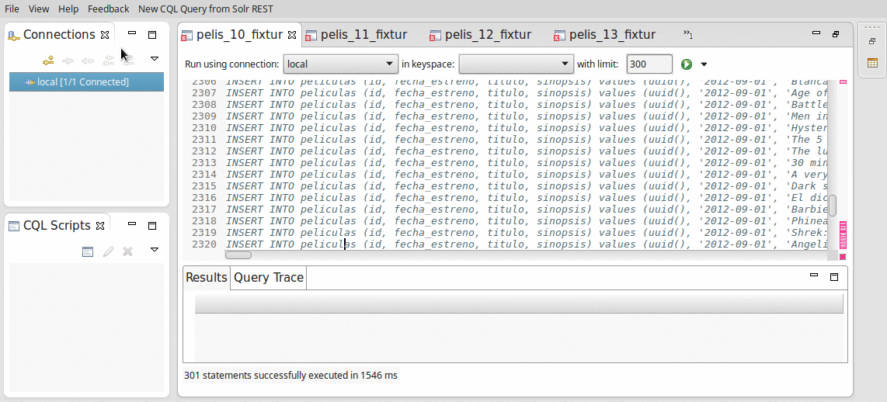
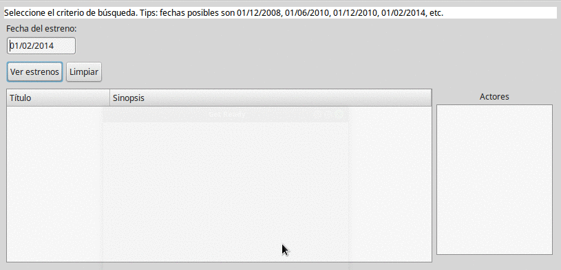

# Estrenos de Películas - Proyecto Xtend con Cassandra

## Objetivo
Permite mostrar los estrenos de películas a partir de una fecha determinada. 

## Modelo
Cada película conoce los actores que participaron en ella.

## Links

* [Explicación general del diseño en Cassandra y de la arquitectura de la aplicación.](https://docs.google.com/document/d/1BgEonT2emC0gLoujYAfzJaB2nmphyJc78H8rm2nrZg4/edit?usp=sharing)

## Instalación

* Tenés que instalar localmente [Cassandra](http://cassandra.apache.org/)
* También el [DataStax DevCenter](http://www.datastax.com/products/datastax-devcenter-and-development-tools), la herramienta para correr queries en CQL (Cassandra Query Language). **Importante:** no instales el OpsCenter porque es la versión anterior del DevCenter que quedó deprecado.
* Correr los queries que están en la carpeta [cassandra-scripts](cassandra-scripts), donde se crea el keyspace y las columns families.
* Este video muestra cómo se trabaja desde el DevCenter

* Una vez completada la carga de películas, podés levantar la aplicación que está basado en
 * Arena 3.6.3
 * Xtend 2.13.0, con la dependencia definida manualmente
 * con el driver 3.4.0 de Cassandra para Java - te dejamos un [link a la documentación](http://docs.datastax.com/en/developer/java-driver//3.4/), que requiere la versión Guava 16 o posterior, por eso las dependencias con Xtend están definidas manualmente

(las fechas de estreno posibles están explicadas en el panel de mensajes de la aplicación)

## Branches

* **master**: tiene la versión actual del Driver de Java (actualizado a Octubre 2016)
* **astyanax2**: tiene la versión del driver Astyanax 2.0.2, utilizada para mostrar los ejemplos hasta Junio 2016
